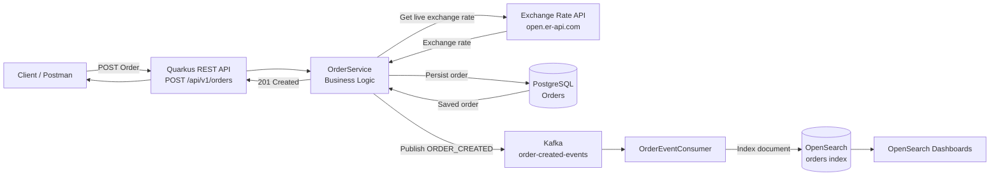

# Currency Order Service

A Quarkus-based microservice that accepts currency conversion orders, converts USD to a target currency using a live exchange-rate API, persists the order in PostgreSQL, publishes an `ORDER_CREATED` event to Kafka, and indexes the order into OpenSearch for analytics and dashboarding.

The service demonstrates a hybrid synchronous and asynchronous architecture:

- **Synchronous:** REST API → Exchange Rate API → PostgreSQL → HTTP Response
- **Asynchronous:** Kafka → Consumer → OpenSearch → OpenSearch Dashboards

---

## Architecture



---

## Request Flow

When a client creates a currency order, the request follows these steps:

1. Client sends a `POST /api/v1/orders` request.
2. `OrderResource` receives the request.
3. `OrderService` handles the business logic.
4. `ExchangeRateClient` calls the live exchange-rate API.
5. The conversion is calculated using `BigDecimal`.
6. The order is persisted in PostgreSQL.
7. An `ORDER_CREATED` event is published to Kafka.
8. The REST API returns the order response to the client.
9. `OrderEventConsumer` consumes the Kafka event asynchronously.
10. The consumer indexes the order into OpenSearch.
11. OpenSearch Dashboards uses the indexed data for analytics and visualization.

This separates the customer-facing order-processing flow from the downstream analytics pipeline.

---

## Technology Stack

| Technology | Purpose |
|---|---|
| Java 17+ | Application development |
| Quarkus | Microservice framework |
| REST API | Order creation endpoint |
| REST Client Reactive | Communication with exchange-rate API |
| PostgreSQL | Transactional order storage |
| Hibernate ORM / Panache | Database persistence |
| Apache Kafka | Event streaming |
| SmallRye Reactive Messaging | Kafka integration |
| OpenSearch | Search and analytics |
| OpenSearch Dashboards | Data visualization |
| Docker | Containerization |
| Docker Compose | Multi-container environment |
| JUnit 5 | Testing |
| Mockito | Mocking dependencies |
| REST Assured | API integration testing |
| Maven | Build and dependency management |

---

## Features

- Currency conversion order API
- Live exchange-rate integration
- PostgreSQL persistence
- Kafka event publishing
- Asynchronous Kafka consumer
- OpenSearch indexing
- OpenSearch Dashboards analytics
- Input validation
- Error handling
- Docker Compose environment
- Automated tests
- Swagger / OpenAPI documentation

---

# API

## Create Currency Order

### Endpoint

```http
POST /api/v1/orders
```

### Request

```json
{
  "customerId": "CUST-1001",
  "amountUSD": 150.00,
  "targetCurrency": "EUR"
}
```

### Example cURL

```bash
curl -X POST http://localhost:8080/api/v1/orders \
  -H "Content-Type: application/json" \
  -d '{
    "customerId": "CUST-1001",
    "amountUSD": 150.00,
    "targetCurrency": "EUR"
  }'
```

### Example Response

```json
{
  "orderId": 1,
  "customerId": "CUST-1001",
  "amountUSD": 150.00,
  "targetCurrency": "EUR",
  "convertedAmount": 138.50,
  "status": "PROCESSED",
  "createdAt": "2026-09-04T05:18:06.203852Z"
}
```

> `convertedAmount` depends on the live exchange rate returned by the external exchange-rate API.

---

## API Documentation

Swagger UI is available when the application is running:

```text
http://localhost:8080/q/swagger-ui
```

OpenAPI specification:

```text
http://localhost:8080/q/openapi
```

---

## Error Handling

The API handles the following error scenarios:

| Scenario | HTTP Status |
|---|---:|
| Invalid request / validation failure | `400 Bad Request` |
| Unsupported currency | `400 Bad Request` |
| Exchange-rate API failure | `502 Bad Gateway` |
| Unexpected server error | `500 Internal Server Error` |

Example:

```text
Invalid currency: ZZZ
→ 400 Bad Request
```

The HTTP response status represents the API outcome, while the database `status` field represents the persisted order state.

---

# Database

PostgreSQL is used as the transactional source of truth for currency orders.

## Orders Table

| Column | Description |
|---|---|
| `id` | Primary key |
| `customer_id` | Customer identifier |
| `amount_usd` | Original USD amount |
| `target_currency` | Target currency |
| `converted_amount` | Converted amount |
| `status` | Order processing status |
| `created_at` | Order creation timestamp |

### Example Order

```text
ID:               1
Customer ID:      CUST-1001
Amount USD:       150.00
Target Currency:  EUR
Converted Amount: 138.50
Status:           PROCESSED
Created At:       2026-09-04T05:18:06Z
```

---

# PostgreSQL vs OpenSearch

PostgreSQL and OpenSearch have different responsibilities in the application.

## PostgreSQL

PostgreSQL is responsible for transactional and durable application data.

It provides:

- ACID transactions
- Strong consistency for transactional operations
- Relational data modelling
- Constraints and relationships
- Reliable persistent storage

## OpenSearch

OpenSearch is used for:

- Fast search
- Aggregations
- Analytics
- Dashboard visualizations
- Read-optimized analytical queries

The same order can exist in both systems, but each system serves a different purpose.

```text
PostgreSQL
    ↓
Transactional Source of Truth

OpenSearch
    ↓
Search + Analytics + Dashboard
```

---

# Kafka

Kafka is used to decouple order processing from the analytics and indexing pipeline.

## Kafka Topic

```text
order-created-events
```

When an order is successfully processed, an `ORDER_CREATED` event is published.

### Kafka Flow

```text
OrderService
     |
     | ORDER_CREATED
     ↓
Kafka Topic
order-created-events
     |
     ↓
OrderEventConsumer
     |
     ↓
OpenSearch
```

## Producer

`OrderService` publishes the order event to Kafka.

## Consumer

`OrderEventConsumer` consumes the event using Quarkus Reactive Messaging.

Conceptually:

```java
@Incoming("order-events-in")
```

The consumer processes the event and indexes the order into OpenSearch.

## Consumer Group

```text
order-service-indexer
```

The consumer group allows Kafka to track consumer progress and provides the foundation for scaling consumers.

---

# Why Kafka?

Kafka provides an asynchronous event-driven boundary between the transactional application flow and the analytics pipeline.

### Without Kafka

```text
REST Request
    ↓
PostgreSQL
    ↓
OpenSearch
    ↓
Response
```

### With Kafka

```text
REST Request
    ↓
PostgreSQL
    ↓
Kafka
    ↓
OpenSearch
```

This separation allows the analytics/indexing pipeline to evolve independently from the core order-processing flow.

Kafka also provides concepts such as:

- Topics
- Partitions
- Consumer groups
- Offsets
- Message retention
- Event replay

---

# Asynchronous Processing

Order creation and analytics indexing are intentionally separated.

## Synchronous Path

```text
Client
  ↓
REST API
  ↓
OrderService
  ↓
Exchange Rate API
  ↓
PostgreSQL
  ↓
HTTP Response
```

## Asynchronous Path

```text
Kafka
  ↓
OrderEventConsumer
  ↓
OpenSearch
  ↓
Dashboard
```

OpenSearch indexing is therefore eventually consistent with PostgreSQL.

There can be a short delay between an order being persisted in PostgreSQL and becoming visible in OpenSearch Dashboards.

Actual delivery, retry, and failure behavior depends on the Kafka and application messaging configuration.

---

# OpenSearch

Orders are indexed into:

```text
orders
```

Each OpenSearch document represents an order.

The `orderId` is used as the document identifier so that repeated processing of the same order can update the same document instead of unnecessarily creating duplicate documents.

### Example Document

```json
{
  "orderId": 1,
  "customerId": "CUST-1001",
  "amountUSD": 150.00,
  "targetCurrency": "EUR",
  "convertedAmount": 138.50,
  "status": "PROCESSED",
  "createdAt": "2026-09-04T05:18:06Z"
}
```

---

# Keyword Fields

Fields such as:

```text
targetCurrency.keyword
customerId.keyword
```

are used for Terms aggregations.

For example:

```text
targetCurrency.keyword
```

can be used to aggregate orders or revenue by currency.

Similarly:

```text
customerId.keyword
```

can be used to aggregate order amounts by customer.

---

# OpenSearch Dashboard

OpenSearch Dashboards provides an analytics view called:

```text
Order Revenue Dashboard
```

The dashboard contains the following visualizations.

## 1. Total Order Revenue

Metric:

```text
SUM(amountUSD)
```

## 2. Revenue Over Time

- Date Histogram: `createdAt`
- Metric: `SUM(amountUSD)`

## 3. Revenue by Currency

Terms aggregation:

```text
targetCurrency.keyword
```

Displayed as a donut/pie visualization.

## 4. Top Customers

Terms aggregation:

```text
customerId.keyword
```

Metric:

```text
SUM(amountUSD)
```

Sorted by descending revenue with a size of:

```text
5
```

---

# Docker

The application can be run using Docker Compose.

The environment contains the following services:

- PostgreSQL
- Kafka
- OpenSearch
- OpenSearch Dashboards
- Order Service

## Start Complete Environment

```bash
docker compose up -d --build
```

## Check Running Containers

```bash
docker compose ps
```

## Check Application Health

```bash
curl http://localhost:8080/q/health
```

---

# Docker Services

| Service | Purpose | Port |
|---|---|---:|
| Order Service | Quarkus application | `8080` |
| PostgreSQL | Database | `5432` |
| Kafka | Event streaming | `9092` / `29092` |
| OpenSearch | Search and analytics | `9200` |
| OpenSearch Dashboards | Visualization | `5601` |

---

# Local Development

To run the infrastructure through Docker while running the Quarkus application directly with Maven:

```bash
docker compose up -d postgres kafka opensearch opensearch-dashboards
```

Start Quarkus in development mode:

```bash
mvn quarkus:dev
```

Or, if the Maven wrapper is available:

```bash
./mvnw quarkus:dev
```

---

# Prerequisites

Make sure the following are installed:

- JDK 17 or newer
- Maven 3.9+
- Docker
- Docker Compose

Verify the installations:

```bash
java -version
mvn -version
docker --version
docker compose version
```

---

# Testing

The project contains business-logic tests and integration tests.

## Business Logic Tests

The exchange-rate client can be mocked so that the business logic can be tested without calling the real external API.

Testing tools include:

- JUnit 5
- Mockito
- Quarkus Test
- Mocked exchange-rate client

Run tests:

```bash
docker compose up -d postgres
mvn test
```

Kafka can be replaced with an in-memory connector in the test profile where configured.

## Integration Tests

Integration tests exercise the REST API using REST Assured and the application environment.

Run:

```bash
mvn verify
```

---

# Project Structure

```text
src/
└── main/
    └── java/
        └── com/example/
            ├── model/
            │   ├── Order
            │   └── OrderStatus
            │
            ├── dto/
            │   ├── OrderRequest
            │   ├── OrderResponse
            │   └── ExchangeRateResponse
            │
            ├── client/
            │   └── ExchangeRateClient
            │
            ├── service/
            │   └── OrderService
            │
            ├── resource/
            │   └── OrderResource
            │
            ├── messaging/
            │   ├── OrderEventConsumer
            │   └── OpenSearchClientProducer
            │
            └── exception/
                ├── Custom Exceptions
                └── Global Exception Mapper
```

---

# Main Components

## OrderResource

Responsible for exposing the REST endpoint:

```text
POST /api/v1/orders
```

It receives the request and delegates business processing to `OrderService`.

## OrderService

Contains the main business logic:

- Validate order
- Fetch exchange rate
- Calculate converted amount
- Persist order
- Publish Kafka event
- Return order response

## ExchangeRateClient

Communicates with the external exchange-rate service.

The project uses:

```text
open.er-api.com
```

to obtain live exchange-rate information.

## OrderEventConsumer

Consumes Kafka events and forwards order data to OpenSearch.

```text
Kafka
  ↓
OrderEventConsumer
  ↓
OpenSearch
```

## PostgreSQL

Stores the durable transactional representation of orders.

## OpenSearch

Stores documents optimized for search and analytics.

---

# Currency Calculation

Currency calculations use `BigDecimal` instead of floating-point arithmetic.

Conceptually:

```text
convertedAmount = amountUSD × exchangeRate
```

Using `BigDecimal` helps avoid common floating-point precision issues that are especially important in financial calculations.

---

# Architecture Characteristics

This project demonstrates several important backend architecture concepts.

## Microservice Architecture

The application is independently deployable and exposes functionality through a REST API.

## Synchronous Processing

The order request requires the exchange-rate lookup and database persistence before returning the API response.

## Asynchronous Processing

Kafka decouples order events from the OpenSearch indexing pipeline.

## Event-Driven Architecture

The `ORDER_CREATED` event represents a business event that can be consumed by downstream components.

## Eventual Consistency

PostgreSQL and OpenSearch may temporarily differ because OpenSearch is updated asynchronously.

## Separation of Concerns

Different components have different responsibilities:

```text
REST Layer
    ↓
Business Layer
    ↓
Persistence / External API / Messaging
```

---

# Running the Complete Application

## 1. Start the Complete Environment

```bash
docker compose up -d --build
```

## 2. Check Services

```bash
docker compose ps
```

## 3. Check Application Health

```bash
curl http://localhost:8080/q/health
```

## 4. Create an Order

```bash
curl -X POST http://localhost:8080/api/v1/orders \
  -H "Content-Type: application/json" \
  -d '{
    "customerId": "CUST-1001",
    "amountUSD": 150.00,
    "targetCurrency": "EUR"
  }'
```

## 5. Open OpenSearch Dashboards

```text
http://localhost:5601
```

## 6. Create Index Pattern

Use:

```text
orders*
```

Select:

```text
createdAt
```

as the timestamp field.

## 7. Open the Order Revenue Dashboard

The dashboard can be used to analyze:

- Total order revenue
- Revenue over time
- Revenue by currency
- Top customers

---

# Health Check

The application exposes Quarkus health endpoints.

Check:

```bash
curl http://localhost:8080/q/health
```

A successful response indicates that the application health endpoint is available.

---

# Summary

Currency Order Service demonstrates a backend architecture using Quarkus, PostgreSQL, Kafka, OpenSearch, and Docker.

The core flow is:

```text
Client
  ↓
Quarkus REST API
  ↓
OrderService
  ├──→ Exchange Rate API
  │
  ├──→ PostgreSQL
  │
  └──→ Kafka
          ↓
     OrderEventConsumer
          ↓
      OpenSearch
          ↓
  OpenSearch Dashboards
```

The architecture combines transactional processing with event-driven analytics, providing a clear separation between the core order-processing path and downstream analytical processing.